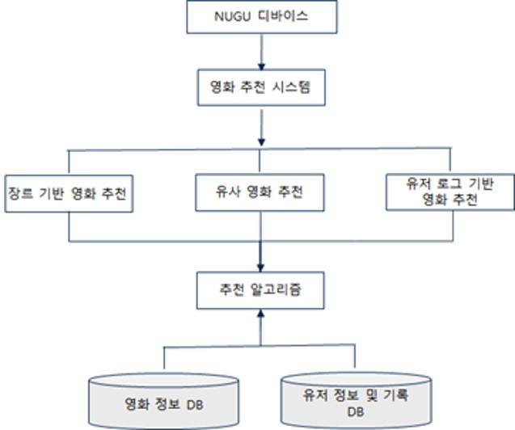
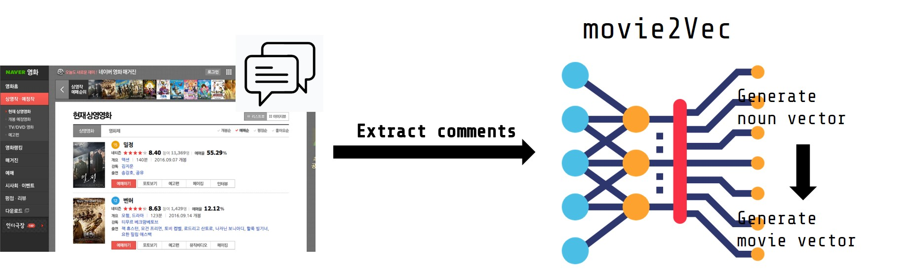
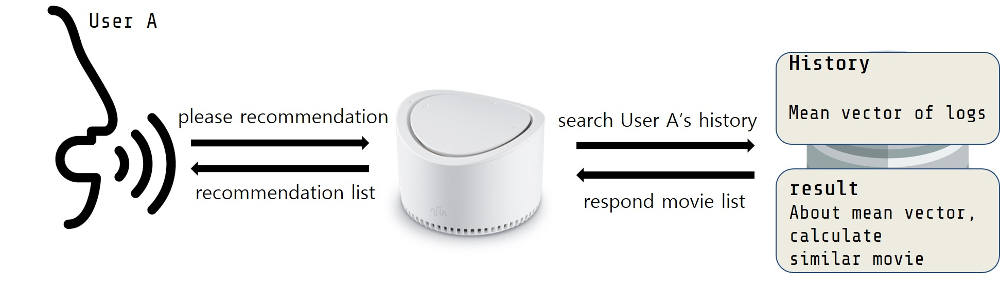
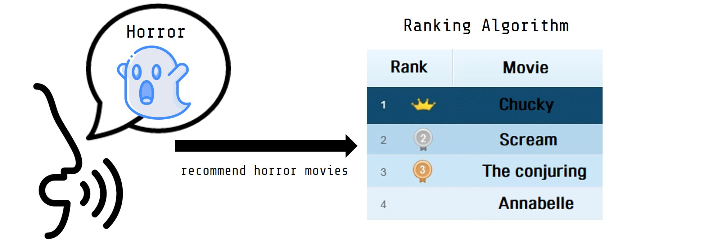
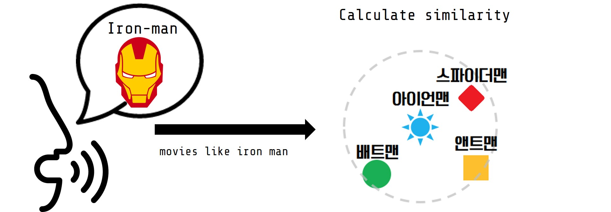

# NUGU_movie_recommendation  
 SKT 석학통합 프로젝트 movie recommendation proxy server in NUGU Play
  
## 프로젝트 소개  
- SK Telecom 산학협력 인공지능 석학사 통합 교과목 진행 프로젝트
- NUGU Play Kit Platform을 이용해서 진행되었으며, 유저 맞춤형 영화 추천 서비스

## 팀 구성
- 서버 구현: [김인호](https://github.com/kih1024)
- 내부 영화 추천 알고리즘: [신태욱](https://github.com/momentum1993), [강승연](https://github.com/tmddusgood)
   
## 개발 동기  
- 혼영, 혼술 등의 여가활동을 집에서 즐기는 "홈스테이족" 증가로 인한 집에서 모든 걸 해결하는 홈코노미 관련 업종들의 뚜렷한 성장세  
- 홈코노미 서비스를 제공하는데 굉장히 적합한 플랫폼인 NUGU를 통해, 개인별 적절한 여가활동 특히 영화라는 도메인을 기반으로한 맞춤형 서비스 기획
   
## 전체 구성도  

  
#### 주요 기능
- 유사 영화 추천
  ex) {아이언맨} 같은 영화 추천해줘
- 유저 로그 기반 추천 (Btv 연동)
  ex) 영화 추천 해줘
- 장르 기반 추천
  ex) {스릴러} 영화 추천해줘
    
## 데이터 추출 과정

- 네이버 영화 페이지 → 영화 리뷰, 줄거리
- 토큰화(명사, 형용사 추출)  
- Word2vec (용언 벡터 → 영화 벡터)  
  
## 유저 로그 기반 추천 서비스

- 유저 로그 정보 기반 - 현재는 proxy 서버의 유저 정보 db로 부터 추출 (현재 특정 Persona에 대한 기록을 임의로 집어넣어 추천 진행)  
- 유저만의 고유 벡터 → 기록을 통한 유저만의 벡터와 그에 대한 유사한 영화 추출 (유저에 따른 추천)
  
## 장르 기반 추천 서비스

- 영화 장르 벡터 & 유저 로그 기반 → 유사 장르의 영화 추천 서비스  
- 공포(horror)라는 장르 요청의 경우: 처키, 스크림, 컨저링, 애나벨  
  
## 비슷한 영화 추천 서비스

- 영화 별 고유 벡터 기반 - Input 영화와 비슷한 영화 추천 서비스    
- '아이언맨 같은 영화 추천해줘'의 경우: 스파이더맨, 앤트맨, 배트맨, 스타워즈, 터미네이터  
  
## 향후 발전 방향
- 현재의 영화를 이용한 서비스에서 예능, 드라마 등의 도메인 확장을 통해서 사용자들에게 더 폭넓은 추천 서비스 제공 가능  
- 스크레이핑한 데이터를 통해서 추천 서비스를 제공하고 있지만, BTV나 WAVVE의 데이터를 이용해서 연계 서비스 제공 가능  
- 시청 기록만을 통해 개인 추천 서비스를 제공하고 있지만, 컨텐츠별 시청 시간 및 사용자 패턴 분석을 통해 더욱 만족스러운 컨텐츠 추천 서비스 제공 가능
- 현재 추천에 사용되는 feature들을 더욱 세분화하거나 추가하여 구체적인 추천 서비스 제공 가능
